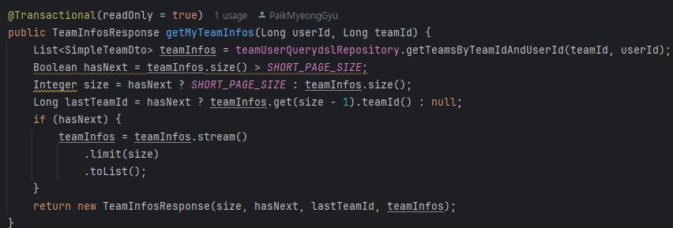

> ### [공통 코드와 Enum]

DB 공통 코드로 만드는 건 분류로 된 그룹 카테코리나 항목 코드 등으로 만드는 것
그러면 팀원들이 공통 코드라고 적어놓고 아무거나 다 때려박는다는 문제가 생길 수 있다.
결과적으로 유지보수하는 과정에서 노답 코드가 될 가능성이 높아진다.

DB 공통 코드로 만드는 것의 장점
- 변경이 자주 일어날 때 좋다.

DB 공통 코드로 만드는 것의 단점
- 매우 가독성이 떨어진다. 
- 공통 코드만 가지고서는 무엇을 의미하는 지 알기는 어렵다.
- 코드 테이블 조회 쿼리가 실행되어야만 한다.
- 코드에서 조건이 추가될수록 변하는 게 많아지고, 매직넘버들이 늘어난다.
- 카테고리는 운영상 거의 바뀌지 않는다. 그렇기 때문에 사실상 장점이 거의 없다고 보는 게 낫다.

Enum으로 관리하게 되면 IDE의 적극적인 지원과 허용 가능한 값으로 제한이 가능하고 리팩토링 범위를 최소화할 수 있다.

- IDE에서 적극적으로 도와준다.
- 허용 가능한 값들로 제한이 가능하다.
- 리팩토링 범위를 최소화할 수 있다.
- Java에서는 Enum이 완전한 기능을 갖춘 클래스이다.

> ### [프로젝트 목표]

프로젝트의 목표는 기존의 페이징 처리 과정을 리팩토리 하는 것이다.
과거 프로젝트에서 아래와 같이 페이징 처리를 위한 코드가 반복적으로 나타나는 걸 보았고 불편함을 느꼈다.

 
[과정 1.] 임시로 페이징 기능 만들기 

- [ ] 게시글 엔티티 작성
- [ ] 게시글 생성 및 페이징 조회 기능 작성
- [ ] 간단한 테스트 코드 작성

[과정 2.]

- [ ] 리팩토링
- [ ] 회귀 테스트 통과 여부 확인